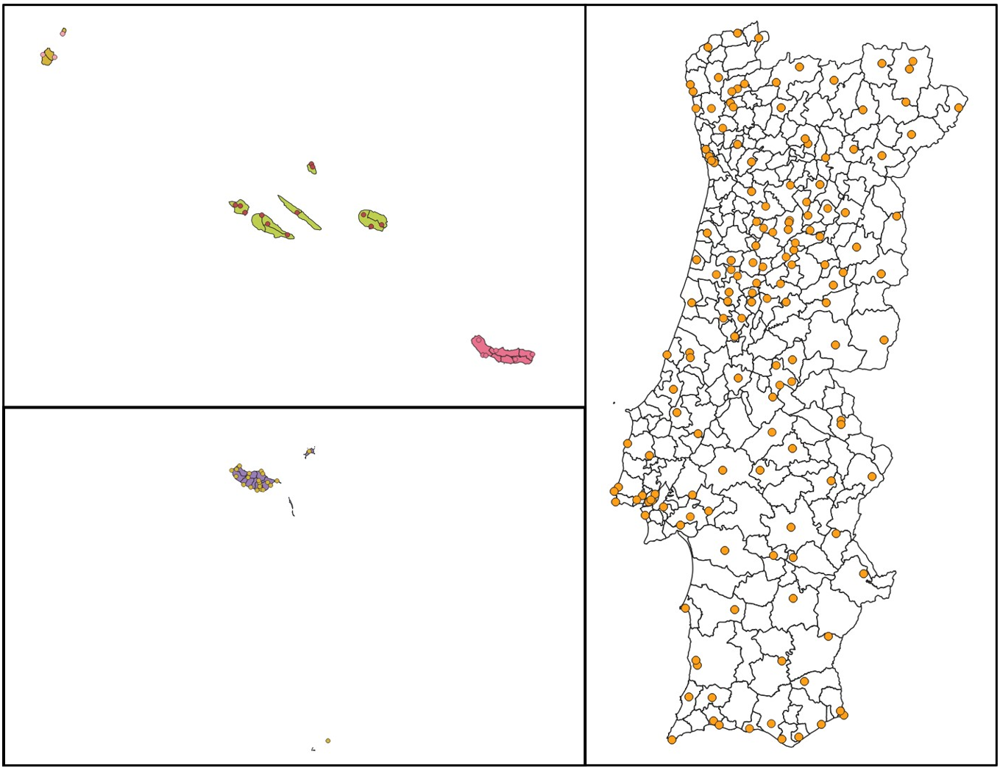

# Portugal Weather Analysis
Creating wind roses and Atlas maps per municipality for Historical Hourly Wind Records of Mainland Portugal, Açores, and Madeira (2018–2023).
<br>
<br>

## Objective Summary
For this project, multiple files in **JSON** format (1.42 GB) containing climate data from different weather stations in Portugal (Mainland and Islands) were cleaned, formatted, and transformed into **CSV** files in order to create proper wind roses per municipality on a yearly, monthly, and yearly + monthly basis. A set of Atlas maps was created using the resulting wind roses.

> An SQLite database is created in order to store all the processed data in a practical way to check and re-use it.

> QGIS is used throughout this project.<br>
> Also known as Quantum GIS, is a geographic information system (GIS) software. More information can be found [here](https://qgis.org/en/site/about/index.html).
<br>


## Project Assumptions
- All partially incomplete records are treated as corrupt and disregarded.

- Data from 2018 and 2023 is not complete for the entire year, given the project's duration. Therefore, while it was utilized for monthly historical analysis, it was not represented on any Atlas map.
<br>

## Project Organization
The project can be divided into six distinct steps.
<br>

### Database structuring, and preliminary data insertion
The data source consists of several JSON files divided into two main groups: one containing data related to the involved Portuguese weather stations, and the other containing data related to hourly observations made by the weather stations between 2018 and 2022.

The first step of the project consisted of the creation of two different tables inside a new SQLite database named `weather.db`.
The table containing stations' data was named `stations` and the one containing records from each station was named `observations`.

All the JSON files were processed, and the main data extracted from them was inserted into each corresponding table.


<br>
<div align="center">
  
  <br>
  <sub>Stations table structure</sub>
</div>
<br>
<br> 
<div align="center">
  
  <br style="margin-bottom: 0.25em;">
  <sub>Observations table structure</sub>
</div>


### Exporting stations' data into QGIS
With both tables filled out with data from the data source, there were two more key parameters missing. Despite having data regarding the stations and their readings, there was no column assigned to the location of the weather stations, except for the coordinates themselves.

For this project, it was crucial to locate the stations in a specific *'concelho'* (municipality) with their respective *'dicofre'* numbers (zip code numbers). The final windroses are created based on each concelho found in Portugal. The dicofre number is a key value for organizational purposes, as the resulting windrose files must contain the dicofre value in their name.

QGIS is involved in the relational part, where each station gets a concelho and dicofre value as a result of their geocoordinates.

All the data inside the stations' table was retrieved and fetched into a CSV file that had to be imported into QGIS.
<br>

### QGIS layers intersection
An already existing QGIS project was used as a base to import the stations' data.
The QGIS project had multipolygon layers imitating each of the concelhos found in Portugal (mainland and islands), covering the total area of the country.
Each multipolygon had a table of attributes with data related to the area covered, such as the concelho, dicofre, area's size, height, etc.

The idea in this step was to import the stations' data CSV file into QGIS as a point layer.
For each station, one point would be represented on the map according to their coordinates (latitude and longitude columns), located somewhere over the already existing multipolygons.

<br>
<div align="center">
  
  <br>
  <sub>Weather stations location</sub>
</div>
<br>

Once imported, the points layer information (stations' data) and the multipolygon information could be merged by means of the 'intersection' tool from QGIS, which intersects two selected layers, creating a new one containing all the data. This new layer was then exported as a new CSV file to work with.

> [!NOTE]
> Both the multipolygonal layers and the imported points layer were using the `EPSG:4326 - WGS 84` Coordinate Reference System (CRS).


> [!WARNING]
> It is important to select UTF-8 as encoding type when importing and exporting the CSV files from QGIS.


### Cleaning and inserting QGIS information into the database
The CSV file exported from QGIS had many information related to the weather stations; not all of it had to be used. In fact, only the id_estacao (station id), the concelho, and the dicofre values for each station were needed.

Although the id_estacao value was already present in the stations table, its condition of **PRIMARY KEY** was needed for the proper insertion of the concelho and dicofre values per station.

Two new columns were created, and the values for the concelho and dicofre per station were inserted based on each id_estacao. Now both tables in the database were totally complete.
<br>

### Retrieving wind data and plotting the final windroses
By means of an inner join, data from both stations and observations table is retrieved in order to collect the required information needed to plot windroses per concelho on a yearly, monthly, and yearly + monthly basis.<br>
An example of a query written to obtain yearly wind data is shown next:

```ruby
YEARLY_WINDSPEED_DIRECTION = """
SELECT strftime('%Y', o.date) as year,
    s.id_estacao,
    CAST(s.dicofre AS INTEGER) as dicofre,
    s.concelho,
    CASE
                WHEN o.id_direcc_vento IN (1, 9) THEN 1.0
                ELSE o.id_direcc_vento
    END AS direcc_vento,
    MIN(o.intensidade_de_vento) as min_int_vento,
    MAX(o.intensidade_de_vento) as max_int_vento,
    ROUND(AVG(o.intensidade_de_vento), 2) as avg_int_vento
FROM observations o
INNER JOIN stations s ON o.id_estacao = s.id_estacao
WHERE o.intensidade_de_vento != -99 AND o.id_direcc_vento != 0
GROUP BY year, dicofre, direcc_vento;
"""
```

As seen in the code block above, the wind direction (id_direcc_vento) was represented with a specific code. Moreover, all the windspeed (intensidade_de_vento) presenting a value of -99 was treated as an error and not taken into account. The windspeed present per direction was supposed to contain the minimum, the maximum and the average values recorded in the concelho during specific the span of time represented.


For the final windroses, _pandas_, _matplotlib_ and _numpy_ were used.
The values for the wind direction were transformed into degrees by applying a mapping.


The resultant windroses presented the following appearance:

<br>
<div align="center">
  
  <br>
  <sub>Lisboa 2018 windrose</sub>
</div>
<br>

> [!NOTE]
> Given the significant difference in wind speed values between the maximum and the minimum, there may be windroses where it can be difficult to distinguish the minimum wind speed value due to the scale.


### Atlas maps
For company purposes, the final wind roses were included in a set of atlas maps that showed the monthly and annual variation of the wind in each municipality during the period of time studied. The final composition of the maps is seen in the following images:

<br>
<div align="center">
  
  <br>
  <sub>Lisboa Atlas Map 1st page</sub>
</div>
<br>

<br>
<div align="center">
  
  <br>
  <sub>Lisboa Atlas Map 2nd page</sub>
</div>
<br>

<br>
<div align="center">
  
  <br>
  <sub>Lisboa Atlas Map 3rd page</sub>
</div>
<br>

> The QGIS Atlas is a true open source technique to generate hundreds of maps in minutes. In the map-making business, this means being efficient without compromising art and intricacy. More information [here](https://gisgeography.com/how-to-create-qgis-atlas-mapbooks/).
