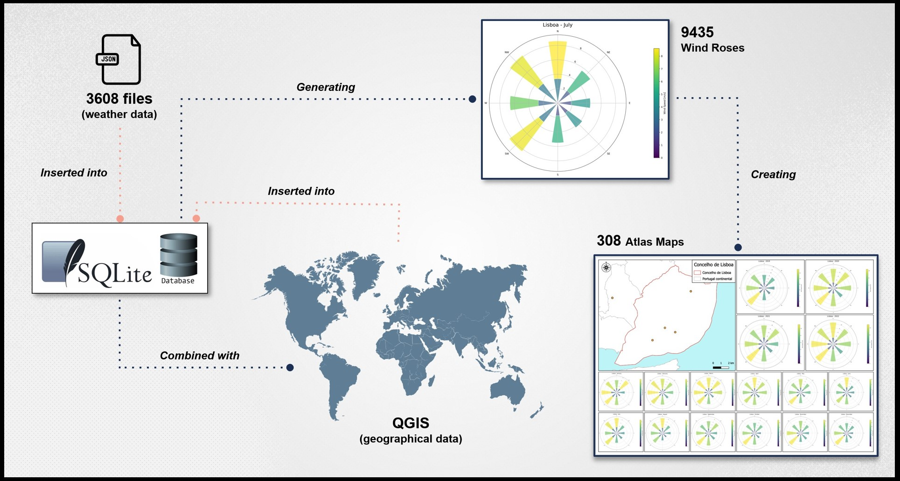

# Portugal Weather Analysis
   <br>
Creating wind roses and Atlas maps per municipality for Historical Hourly Wind Records of Mainland Portugal, Açores, and Madeira (2018–2023).
<br>
<br>
<h2>
   
  <span style="vertical-align: middle;">Requirements</span>
</h2>

```
pip install -r requirements.txt
```
<br>

<h2>
   
  <span style="vertical-align: middle;">Summary</span>
</h2>

For this project, multiple files in **JSON** format (1.42 GB) containing climate data from 2018 to 2023 registered by different weather stations in Portugal (Mainland and Islands), were cleaned, formatted, and transformed into **CSV** files in order to create proper wind roses per municipality on a yearly, monthly, and yearly + monthly basis.<br> A set of Atlas maps was created using the resulting wind roses.

> SQLite for the database creation.

> QGIS is used throughout this project.<br>
> Also known as Quantum GIS, is a geographic information system (GIS) software. More information can be found [here](https://qgis.org/en/site/about/index.html).
<br>
<br>
<div align="center">
  
  <br>
  <sub>Project Workflow</sub>
</div>
<br>


<h2>
   
  <span style="vertical-align: middle;">Project Assumptions</span>
</h2>

- All partially incomplete records are treated as corrupt and disregarded.

- Data from 2018 and 2023 is not complete for the entire year, given the project's duration. Therefore, while it was utilized for monthly historical analysis, it was not represented on any Atlas map.
<br>


<h2>
   
  <span style="vertical-align: middle;">Project Organisation</span>
</h2>

The specific workflow followed in this project can be found in the [documentation file](/docs/project-organisation.md).
<br>


<h2>
   
  <span style="vertical-align: middle;">Instructions</span>
</h2>

The execution for this program is divided by two steps, one before the QGIS data transformation and another right after importing the merged datafiles.<br>
Once the 'cd' is set to be the project's folder, the next step would be to deactivate the following functions before running any script.<br>
In the 'main.py' script, comment out the 'POST-QGIS' set of functions:<br><br>

```
if __name__=="__main__":

# SQLite DB connection
    database = sqlite3.connect("weather.db")

# PRE-QGIS__________________________________________________________
#Enable only the next 2 steps, previous to any QGIS transformation
    create_insert_tables()
    export_stations_coordinates()

# POST-QGIS_________________________________________________________
#Comment the previous 2 steps after importing the QGIS CSV files
    #clean_imported_csv()
    #create_insert_dicofre_concelho()
    #get_wind_data()
    #create_windroses()
#___________________________________________________________________
    database.close()
```

Now, it is possible to proceed with the **first execution step**.

```
python source/main.py
```
<br>

<br>
Using the new retrieved stations' data stored in the [stations' data pre-qgis folder](/csv_files/stations_pre_qgis), the intersecting process must be done by means of QGIS.<br>
The data obtained from this process must have the same structure as the files shown in the [qgis imported folder](/csv_files/qgis_imported) for the next procedures to correclty proceed.
<br>

Before the **second execution step**, the commented lines must be altered again:<br><br>

```
if __name__=="__main__":

# SQLite DB connection
    database = sqlite3.connect("weather.db")

# PRE-QGIS__________________________________________________________
#Enable only the next 2 steps, previous to any QGIS transformation
    #create_insert_tables()
    #export_stations_coordinates()

# POST-QGIS_________________________________________________________
#Comment the previous 2 steps after importing the QGIS CSV files
    clean_imported_csv()
    create_insert_dicofre_concelho()
    get_wind_data()
    create_windroses()
#___________________________________________________________________
    database.close()
```

The same command is run:

```
python source/main.py
```
<br>

